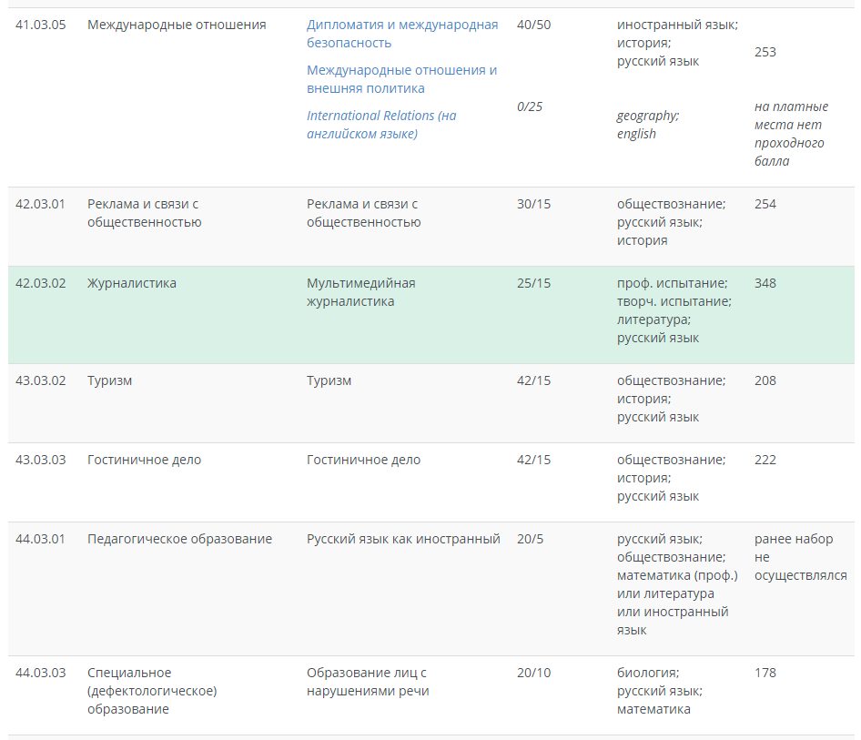

# Метод "персон"

> Рассматриваесый университет: Дальневосточный Федераьный Университет, далее ДВФУ.

## Персонаж №1:
### Идентификаторы: 
- Имя: Егор
- Фамилия: Антипов
- Отчество: Павлович
 

### Демографические показатели:
- Пол: Мужской
- Возраст: 17 лет
- Вид дейтельности: Учеба
- Образование: Среднее общее образование
 

### География:
- Страна: Российская Федерация
- Город: Чита
- Район: Центральный
 

### Психография:
- Увлечения и интересы: Чтение книг (художественных) и статей, журналистика, компьютерные игры, просмотр фильмов
- Хобби: Написание рецензий на фильмы, книги, статьи и игры
 

### Ресурсы:
- Время: 4:00 PM - 8:00 AM (время за исключением учебы)
- Мобильность: Полная без ограничений
 

### Опыт использования интернета:
- Как часто пользуется интернетом: Очень часто
- Какие сайты посещает: Сайты онлайн бибиотек/архивов, игровые, новостные ресурсы, онлайн кинотеатры итд...
- Каким поимковиком пользуется: Google, очень редки Yandex
- Уверенность пользования компьютером: Высокая
- Какие социальные сети использует: Vk, twitter, instagram
- Для чего чаще всего использует интернет: Развленчение и поиск информации
 

### Повседневные характеристики:
- Цель посещения сайты: Получить информацию по направлению "журналистики" в данном университете (ДВФУ)
- Какие качества продуката (сайта) важны: Интуитивность навигации, приятный внешний вид сайта, информативность представленных на сайте данных
- Опасения/беспокойства: Серьезность принимаемого решения, давление со строны родителей и окружающих людей
 

### Сценарии:
- Мотивация: Желание поступить в данный университет
- Цель: Получение сведений о нобходимых предматах, баллах и колличество бюджетных мест для поступления на специальность "журналистика"
- User-flow: 
> Вход на главную страницу сайта

 

> Выбор степени

 

> Проверка колличества мест, перечень необходимых предметов и баллов для поступления на данную пециальность

 

### Оценка сценария:
- Цель персонажа достигнута?: Да
- Насколько персонажу было трудно её достигнуть?: не очень, единственная помеха - это не сгруппированность направлений из-за чего могут возникнуть проблему с поиском нужного направления (персонаж использовал поиск по странице)
- Мог ли персонаж отказаться от цели или достичь её не используя сайт?: Персонаж не могу отказаться от цели и также мог достигнуть ее другим путем (позвонить либо лично узнать нужную информацию)
   

## Персонаж №2:
### Идентификаторы: 
- Имя: Андрей
- Фамилия: Потапов
- Отчество: Романович
 

### Демографические показатели:
- Пол: Мужской
- Возраст: 22 года
- Вид дейтельности: Учеба
- Образование: Среднее общее образование
 

### География:
- Страна: Россия
- Город: Владивосток
- Район: Фрунзенский
 

### Психография:
- Увлечения и интересы: Чтение книг/статей, просмотр фильмов и прослушивание музыки
- Хобби: Программивароние
 

### Ресурсы:
- Время: 4:00 PM - 8:00 AM (время за исключением учебы)
- Мобильность: Полная без ограничений
 

### Опыт использования интернета:
- Как часто пользуется интернетом: Очень часто
- Какие сайты посещает: Оналайн кинотеатры, библотеки, сайты для прослушивания музыки и сайты для программистов (habr, itproger итд...)
- Каким поисковиком пользуется: Google 
- Уверенность пользования компьютером: Высокая
- Какие социальные сети использует: Vk, twitter
- Для чего чаще всего использует интернет: Получения информации касающейся программирования, а также развлечение
 

### Повседневные характеристики:
- Цель посещения сайта: Узнать график осенней сессии 
- Какие качества продуката (сайта) важны: Удобство навигации, приятный внешний вид
- Опасения/беспокойства: Не успеть подготовится к сессии
 

### Сценарии:
- Мотивация: Сдать осеннюю сессию
- Цель: Узнать график осенней сессии 
- User-flow: 
> Вход на главную страницу сайта

 

> Выбор пункта "расписание занятий"

 

> Выбор пункта с росписанием сессии

 

> Уточнение дат проведения экзаменов

 

### Оценка сценария:
- Цель персонажа достигнута?: Да
- Насколько персонажу было трудно её достигнуть?: Совсем не трудно
- Мог ли персонаж отказаться от цели или достичь её не используя сайт?: Персонаж не могу отказаться от цели, так как не хочет лишится стипендии, также персонаж мог достичь цели не использую сайт (в личном кабинете либо около стденчиского офиса)